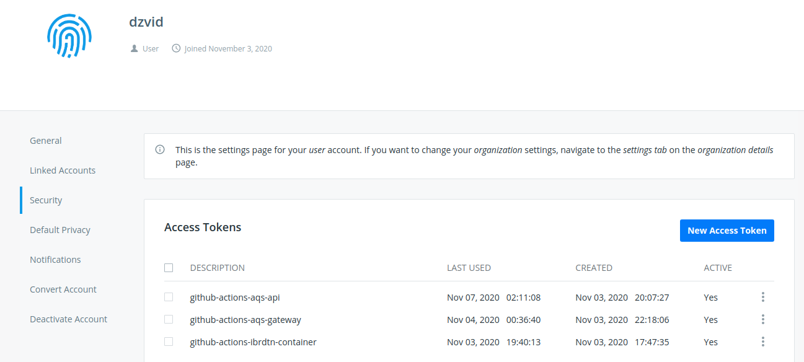

# IBRDTN - Dockerfile 🐳

Dockerfile to build a docker image for the Bundle protocol implementation [IBRDTN](https://github.com/ibrdtn/ibrdtn).
The image use `debian:stretch-slim` as base image. We leverage Github infrastructure to multi-arch builds.

### Prerequisites
- **Install Docker**: Follow the official [tutorial](https://docs.docker.com/install/). Docker version used in this project: `v19.03.13, build 4484c46d9d`.
-  **Host machine settings**:
    - A host computer running following operational system: `Linux Ubuntu 18.04.5 LTS` or greater. 

      or

    - If deploying services in a Raspberry Pi, use the following operational system: `Raspberry Pi OS (32-bit) Lite, version August 2020 release date 2020-08-20, kernel version 5.4`; 
  
### Usage 
The docker image built in this repository is disponible at [Docker Hub](https://hub.docker.com/r/dzvid/ibrdtn). The image can be used in following architectures: `linux/386,linux/amd64,linux/arm/v6,linux/arm/v7,linux/arm64`.

To create a docker container run the following command in terminal (assuming that you are using a GNU/Linux host):
```bash
docker run -d -it --name CONTAINER_NAME
-v /etc/timezone:/etc/timezone:ro 
-v /etc/localtime:/etc/localtime:ro 
--network=host
dzvid/ibrdtn:latest
```
#### Volumes
Depending on IBRDTN configuration, you may want to load your custom ibrdtn.config, persistent storage of bundles and/or Register IBRDTN daemon logs. Three directories have been created in the image to be used for configuration, persistent storage and logs:
   ```
      /ibrdtn/config
      /ibrdtn/bundles
      /ibrdtn/logs
   ```  

- Using volume for IBRDTN configuration file (ibrdtn.conf):
   1. Create your custom IBRDTN configuration file on a suitable volume on your host system, e.g. /host-path/your-custom-ibrdtn.conf
   2. Start your ibrdtn container like this: 
   ```bash
   docker run -d -it --name CONTAINER_NAME
   -v /host-path/your-custom-ibrdtn.conf:/ibrdtn/config/ibrdtn.conf
   -v /etc/timezone:/etc/timezone:ro 
   -v /etc/localtime:/etc/localtime:ro 
   --network=host
   dzvid/ibrdtn:latest
   ```
- Using volume for IBRDTN permanent storage of bundles:
   1. Create your custom IBRDTN bundles directory on a suitable volume on your host system, e.g. /host-path/bundles
   2. Start your ibrdtn container like this: 
   ```bash
   docker run -d -it --name CONTAINER_NAME
   -v /host-path/bundles:/ibrdtn/bundles
   -v /etc/timezone:/etc/timezone:ro 
   -v /etc/localtime:/etc/localtime:ro 
   --network=host
   dzvid/ibrdtn:latest
   ```

- Using volume for IBRDTN logs:
   1. Create your custom IBRDTN logs directory on a suitable volume on your host system, e.g. /host-path/log
   2. Start your ibrdtn container like this: 
   ```bash
   docker run -d -it --name CONTAINER_NAME
   -v /host-path/log:/ibrdtn/log
   -v /etc/timezone:/etc/timezone:ro 
   -v /etc/localtime:/etc/localtime:ro 
   --network=host
   dzvid/ibrdtn:latest
   ```
   You can use all volumes at once:
   ```bash
   docker run -d -it --name CONTAINER_NAME -v /host-path/ibrdtn.conf:/ibrdtn/config/ibrdtn.conf -v /host-path/ibrdtn/bundles:/ibrdtn/bundles -v /host-path/log:/ibrdtn/log -v /etc/timezone:/etc/timezone:ro -v /etc/localtime:/etc/localtime:ro --restart always --network=host dzvid/ibrdtn:latest
   ```

#### IBRDTN debug mode
To create a container with IBRDTN debugging enabled, it is necessary to overwrite the image entrypoint, using docker --entrypoint flag for this, replacing `DEBUG_VALUE` with desired IBDTN debug level:
```bash
--entrypoint='/bin/bash' dzvid/ibrdtn:latest  -c 'dtnd -c /ibrdtn/config/ibrdtn.conf -d DEBUG_VALUE'
```
So create a container like this:
```bash
docker run -d -it --name CONTAINER_NAME
-v /etc/timezone:/etc/timezone:ro 
-v /etc/localtime:/etc/localtime:ro 
--network=host
--entrypoint='/bin/bash' dzvid/ibrdtn:latest  -c 'dtnd -c /ibrdtn/config/ibrdtn.conf -d DEBUG_VALUE'
```

To create using all volumes with debugging enabled:
```bash
docker run -d -it --name CONTAINER_NAME -v /host-path/ibrdtn.conf:/ibrdtn/config/ibrdtn.conf -v /host-path/ibrdtn/bundles:/ibrdtn/bundles -v /host-path/log:/ibrdtn/log -v /etc/timezone:/etc/timezone:ro -v /etc/localtime:/etc/localtime:ro --restart always --network=host --entrypoint='/bin/bash' dzvid/ibrdtn:latest  -c 'dtnd -c /ibrdtn/config/ibrdtn.conf -d DEBUG_VALUE'
```


## Build image
### Local build
1. Clone this repository to your machine:

   ```bash
   git clone git@github.com:dzvid/ibrdtn-container.git
   ```

2. Build the image:
   ```bash
   docker build . -t insert_tag_name
   ``` 
### Multi-arch build using GitHub Action: [docker/build-push-action](https://github.com/docker/build-push-action)
   `docker/build-push-action` is a GitHub Action to build and push Docker images with Buildx to Docker hub. This repository has continuous integration (CI) using GitHub Actions enabled, the workflow is described in the configuration file `.github/workflows/build-image.yml`. The workflow is triggered once a push is made to master branch or manually acessing `Actions` in menu, selecting the workflow and re-running jobs.
   For Github Actions be able to push the imagens to Docker hub, it is necessary to configure Docker hub access credentials in the repository secrets:
      
   1. Go to your [Docker Hub security settings](https://hub.docker.com/settings/security) to create a new access token:
   
   2. After creating the access token, go to your repository settings, and in the `Secrets` section create the following environment variables:
      - `DOCKERHUB_TOKEN`: The token generated in Docker Hub in step 1;
      - `DOCKERHUB_USERNAME`: Your Docker Hub username.
   3. Select the architectures you want to target in the file `.github/workflows/build-image.yml`. The following architectures are targeted by default: `linux/386,linux/amd64,linux/arm/v6,linux/arm/v7,linux/arm64`.
   4. Push changes to your repository and wait for CI to build and push image to Docker Hub.

### Local Multi-arch build
For local multi-arch build, please refer to this link: [Getting started with Docker for Arm on Linux](https://www.docker.com/blog/getting-started-with-docker-for-arm-on-linux/). It has all the instructions necessary to build Docker images for architectures different from the host machine.

## Contributing

Contributions are what make the open source community such an amazing place to learn, inspire, and create. Any contributions you make are **greatly appreciated**.

1. Fork the Project
2. Create your feature branch (`git checkout -b feature/AmazingFeature`)
3. Commit your changes (`git commit -m 'Add some AmazingFeature'`)
4. Push to the dev branch (`git push origin feature/AmazingFeature`)
5. Open a pull request
   
## License

The repository code/resources are licensed under [Apache 2.0 license](./LICENSE).

## Acknowledgements

- [Multi-arch build and images, the simple way](https://www.docker.com/blog/multi-arch-build-and-images-the-simple-way/)
- [docker/build-push-action](https://github.com/docker/build-push-action)
- [Getting started with Docker for Arm on Linux](https://www.docker.com/blog/getting-started-with-docker-for-arm-on-linux/)
